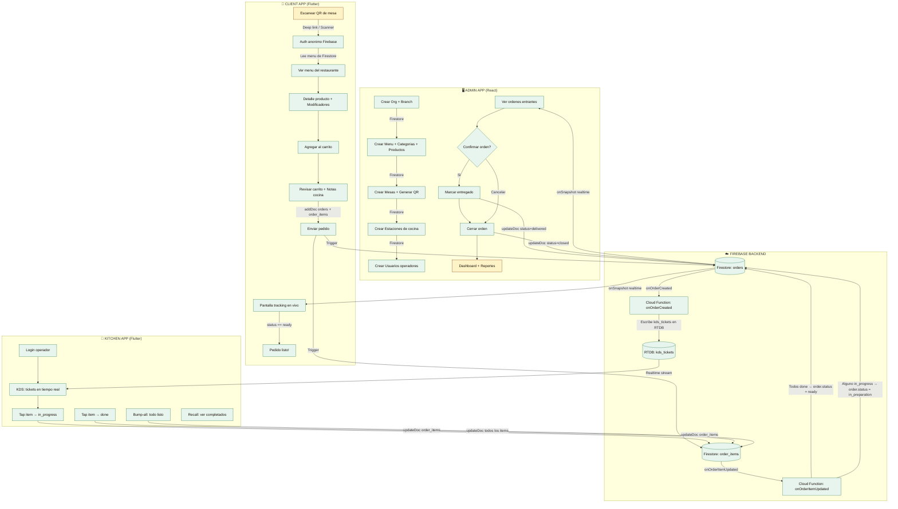
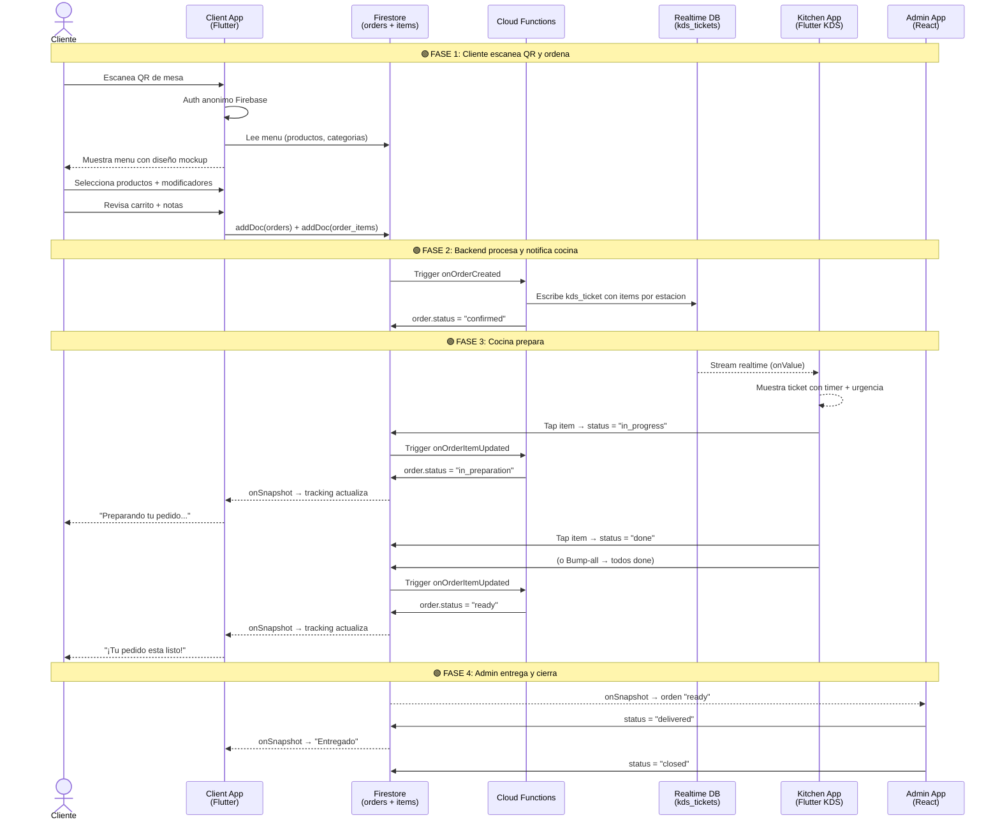
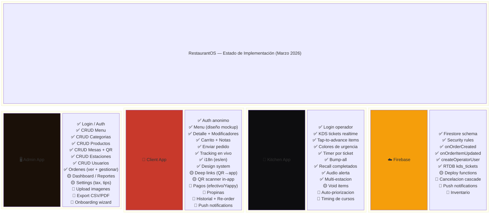

# RestaurantOS — Flujo Completo de Pedido

## Diagrama de Flujo End-to-End

## Diagrama de Secuencia — Flujo de un Pedido

## Estado por Componente

## Leyenda

| Simbolo | Significado |
|---------|-------------|
| ✅ | Implementado y funcionando |
| 🟡 | Parcialmente implementado o pendiente de deploy |
| 🔴 | No implementado aun |

## Comunicacion entre Apps

| De → A | Mecanismo | Datos |
|--------|-----------|-------|
| Client → Firestore | `addDoc()` | Crea orders + order_items |
| Firestore → Cloud Functions | Triggers `onWrite` | onOrderCreated, onOrderItemUpdated |
| Cloud Functions → RTDB | Admin SDK `set()` | kds_tickets para cocina |
| RTDB → Kitchen | `onValue` stream | Tickets en tiempo real |
| Kitchen → Firestore | `updateDoc()` | Actualiza status de items |
| Firestore → Client | `onSnapshot` listener | Tracking de orden en vivo |
| Firestore → Admin | `onSnapshot` listener | Lista de ordenes en vivo |
| Admin → Firestore | `updateDoc()` | Cambia status de orden |
| QR (impreso) → Client | Deep link / URL | orgId, branchId, tableId |
